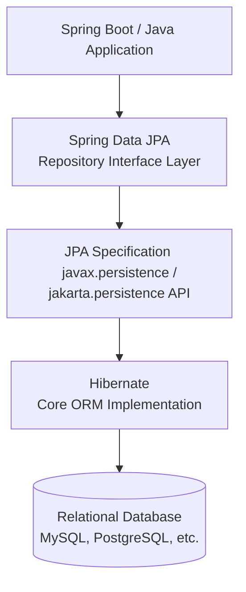

# Comparison: JPA vs. Hibernate vs. Spring Data JPA

Understanding the differences between JPA, Hibernate, and Spring Data JPA is fundamental to building robust Java-based data access layers. Although they are closely related and work together, they serve entirely different purposes.

---

## Quick Summary

| Feature | JPA (Java Persistence API) | Hibernate | Spring Data JPA |
| :--- | :--- | :--- | :--- |
| **What is it?** | A **Specification** / Standard | An **Implementation** (ORM Provider) | A **Spring Abstraction Layer** |
| **Type** | Java EE / Jakarta EE Guideline | Concrete Library / Framework | Spring Framework Extension |
| **Goal** | Defines *how* ORM should behave using annotations and interfaces. | Actually connects to the database and maps Java objects to tables. | Eliminates boilerplate code by auto-generating repository implementations. |
| **Key APIs** | `javax.persistence.EntityManager`, `@Entity` | `org.hibernate.Session`, `SessionFactory` | `org.springframework.data.repository.Repository` |
| **Under the Hood** | Needs an implementation to run. | Implements JPA interfaces under the hood. | Requires a JPA provider (like Hibernate) to execute database queries. |

---

## 1. JPA (Java Persistence API / Jakarta Persistence)

### The Specification
JPA is a **specification** (a document of standards and guidelines) under Jakarta EE (formerly Java EE) for mapping Java objects to relational databases. 

* **Metaphor:** Think of JPA as an **Interface** in Java. It defines the names of methods and rules, but contains no working code inside them.
* **Key Components:**
  * Defines standard annotations like `@Entity`, `@Table`, `@Id`, `@OneToMany`, etc.
  * Defines standard interfaces like `EntityManagerFactory`, `EntityManager`, and `Query`.
  * Defines a query language called JPQL (Java Persistence Query Language).
* **Can you run JPA alone?** No. If you use JPA without an implementation, it will not do anything because there is no concrete code to execute the database connections.

---

## 2. Hibernate

### The ORM Implementation
Hibernate is a concrete **Object-Relational Mapping (ORM) framework** that implements the JPA specification.

* **Metaphor:** Think of Hibernate as the **Class that implements the Interface** (JPA). It provides the actual code that performs the database queries, connection pooling, and object mapping.
* **Key Components:**
  * Implements all JPA annotations and interfaces (e.g., Hibernate's `Session` implements JPA's `EntityManager`).
  * Provides its own proprietary features and enhancements (e.g., Hibernate Query Language - HQL, caching, dirty checking, custom generator types).
  * Can be used as a standalone ORM framework without using the JPA wrapper, though using it via the JPA standard is highly recommended for portability.

---

## 3. Spring Data JPA

### The Abstraction Layer
Spring Data JPA is a **framework extension** from the Spring team. It sits on top of a JPA provider (like Hibernate) to significantly reduce the boilerplate code required to write data access logic.

* **Metaphor:** Think of Spring Data JPA as a **Helper Library** that automatically generates the database access methods for you so you don't have to write them manually.
* **Key Components:**
  * Introduces the repository abstraction: you define interfaces that extend `JpaRepository` or `CrudRepository`, and Spring automatically implements them at runtime.
  * Allows query creation directly from method signatures (e.g., declaring `List<User> findByLastNameAndAge(String lastName, int age)` automatically generates the SQL query).
  * Simplifies features like pagination, sorting, and transaction management.
* **How it works:** Spring Data JPA **does not** replace Hibernate. It still uses Hibernate (or another JPA provider) under the hood to perform the actual database mapping and execution.

---

## How They Work Together (The Architecture)

1. The **Application** calls methods on a Spring Data JPA Repository.
2. **Spring Data JPA** translates the method calls into JPA queries and calls the standard JPA interfaces (like `EntityManager`).
3. **Hibernate** (the JPA implementation) processes the JPA calls, converts them into raw SQL dialects, and sends them to the **Database**.
